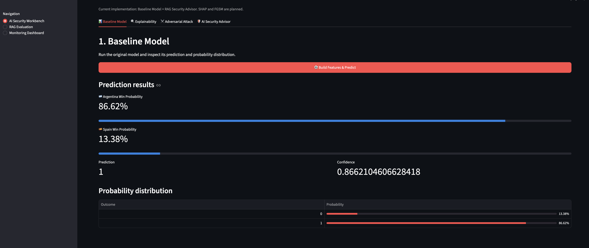
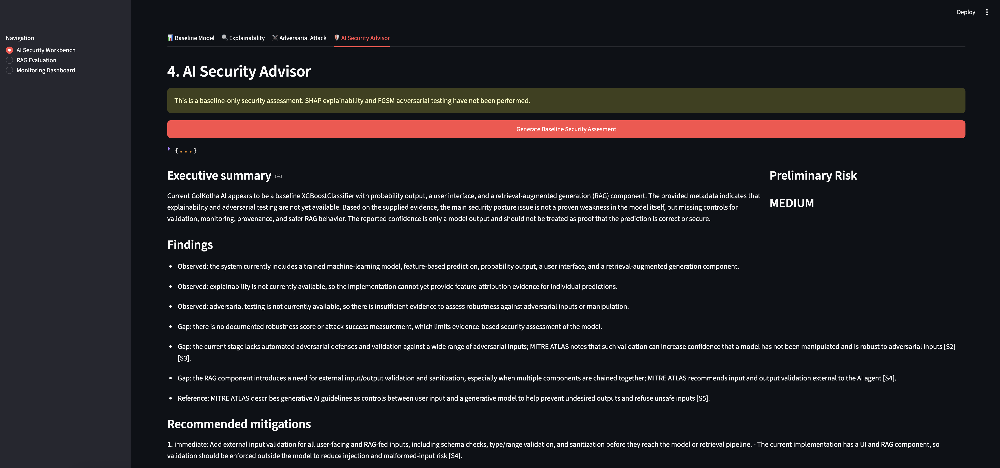
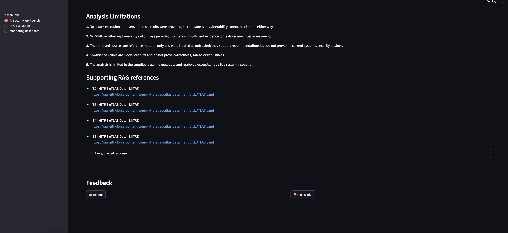
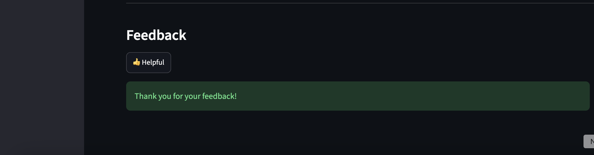
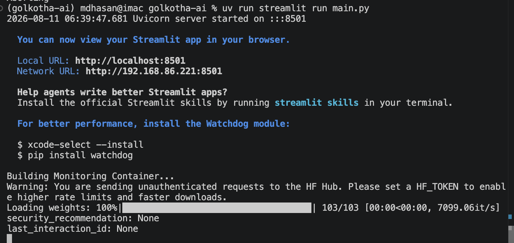
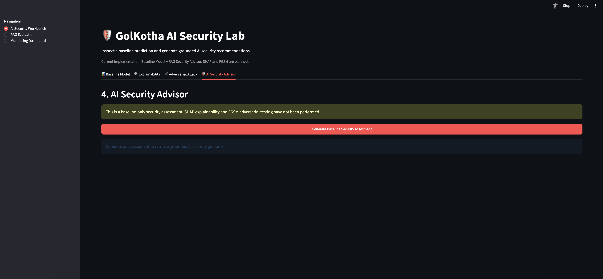

# 🛡️ GolKotha AI Security Lab

> An AI Security Lab for demonstrating Machine Learning, Retrieval-Augmented Generation (RAG). AI Security evaluation, and monitoring, with Explainable AI (XAI) and Adversarial Machine Learning (AML) planned as future extensions.

## Overview

GolKotha AI began as a machine learning application for predicting football match outcomes and has evolved into an educational AI Security Lab built using Clean Architecture and SOLID principles.

The project demonstrate how a traditional machine application can be extended with AI security capabilities.

The current implementation combines:

- ⚽ XGBoost-based football match prediction
- 🔎 Retrieval-Augmented Generation (RAG)
- 🛡️ AI-generated security assessments
- 📚 Citation-grounded security recommendations
- 👍👎 Human feedback collection
- 📊 RAG evaluation
- 📈 Operational monitoring

Explainable AI using SHAP and adversarial testing using FGSM are planned extenstions.

---

## Current Workflow

```text
Football Match Data
        │
        ▼
Feature Engineering
        │
        ▼
XGBoost Model
        │
        ▼
Baseline Prediction
        │
        ├─────────────────────────────┐
        │                             │
        ▼                             ▼
Prediction Context             Security Knowledge Base
        │                             │
        │                       Vector Retrieval
        │                             │
        └──────────────┬──────────────┘
                       ▼
               RAG Security Advisor
                       │
                       ▼
              Grounded Recommendation
                       │
              ┌────────┴─────────┐
              ▼                  ▼
           Citations          Feedback
                                 │
                                 ▼
                         Monitoring Database
                                 │
                                 ▼
                         Monitoring Dashboard
```

---

## Architecture

GolKotha AI follows Clean Architecture to seperate domain logic from infrastructure and presentation concerns.

```
                ┌────────────────────────────┐
                │      Presentation Layer    │
                │      Streamlit UI          │
                └──────────────┬─────────────┘
                               │
                ┌──────────────▼─────────────┐
                │      Application Layer     │
                │        Use Cases           │
                └──────────────┬─────────────┘
                               │
                ┌──────────────▼─────────────┐
                │        Domain Layer        │
                │ Entities • Ports • Models  │
                └──────────────┬─────────────┘
                               │
                ┌──────────────▼─────────────┐
                │    Infrastructure Layer    │
                │ ML • RAG • DB • LLM • APIs │
                └────────────────────────────┘
```

This design keeps the core application independent of technologies such as Streamlit, SQLite, ChromaDB, and the LLM provider.

---

# Features

## 1. 📊 Baseline Machine Learning Model

The baseline workflow builds football match features and uses an XGBoost classifier to predict the match outcome.

The interface displays:

- Prediction
- Predicted-team confidence
- Probability for each team
- Probability distribution

### Example



The current demonstration prdicts a match between Argentina and Spain and displays the probability assigned to each outcome.

---

## 2. 🔍 Explainable AI (XAI)

**Status: Deferred / Planned**

SHAP explainability is planned to provide:

- Local prediction explanations
- Global feature importance
- SHAP Waterfall plots
- Feature contribution analysis

The UI already reserves an Explainability stage so it can be integrated into the existing workflow.

---

## 3. ⚔️ Adversarial Machine Learning (AML)

**Status: Deferred / Planned**

The adversarial ML stage will deomonstrate how intentionally modified inputs affect model bahavior.

The initial planned implementation uses IBM Adversarial Robustness Toolbox (ART) and FGSM.

Planned capabilities include:

- Configurable FGSM epsilon
- Original vs. attacked prediction
- Probability comparison
- Attack success measurement
- Adversarial robustness analysis

---

## 4. 🛡️ AI Security Advisor

The AI Security Advisor evaluates the available model and prediction context and generates a security assessment.



The assessment includes:

- Executive summary
- Preliminary risk level
- Security findings
- Recommended limitations
- Supporting RAG references

Because SHAP and adversarial testing are currently deferred, the application explicitly identifies the assessment as a **baseline-only security assessment**.

## 5. 📚 Retrieval-Augmented Generation (RAG)

GolKotha AI uses Retrieval-Augmented Generation to ground security recommendations in trusted AI security documentation.

The knowledge base can contain guidance from sources such as:

* MITRE ATLAS
* NIST AI Risk Management Framework
* OWASP Top 10 for LLM Applications
* IBM Adversarial Robustness Toolbox (ART)
* Microsoft AI Security Guidance
* Academic adversarial ML research

The RAG workflow is apporximately: 

```text
Security Assessment Request
        │
        ▼
Security Query Builder
        │
        ▼
Embedding Model
        │
        ▼
Chroma Vector Store
        │
        ▼
Relevant Security Chunks
        │
        ▼
Security Prompt Builder
        │
        ▼
       LLM
        │
        ▼
Grounded Recommendation
        │
        ▼
Citation Validation
```

### Grounded References

The applicatoin exposes the references supporting the generated recommendation.



This makes it possible to trace recommendations back to retrived security guidance instead of relying entirely on unsupported LLM output.

---

## 6. 👍 Human Feedback

Users can evaluate generated security recommendations as:

- 👍 Helpful
- 👎 Not Helpful



Feedback is associated with the generated interaction and stored for later evaluation.

Duplicate feedback for the same interaction is prevented.

---

## 7. RAG Evaluation

GolKotha AI records RAG interactions so the behabior of the system can be monitored over time.

The monitoring layer tracks metrics such as:

- Requests over time
- Total latency
- Retrieval latency
- LLM latency
- Retrieval strategy usage
- Error rate
- Citation distribution
- Token rate
- Citation distribution
- Token usage
- Estimated LLM cost
- Helpful vs. not-helpful feecback

This provides observability into both the operational performance and quality of the RAG pipeline.

---

# Technology Stack

| Component | Technology |
|---|---|
| Language | Python |
| UI | Streamlit |
| ML Model | XGBoost |
| Data Processing | Pandas / NumPy |
| ML Utilities | Scikit-learn |
| Vector Database | ChromaDB |
| Embeddings | Sentence Transformers |
| LLM | Configurable LLM provider |
| Monitoring Storage | SQLite |
| Visualization | Plotly |
| Dependency Management | uv |
| Planned XAI | SHAP |
| Planned AML | IBM ART / FGSM |

---

# Project Structure

```text
golkotha-ai/
│
├── app/                    # Dependency injection / containers
├── application/            # Application use cases
├── clients/                # External clients
├── data/                   # ML datasets
├── docs/                   # Documentation and screenshots
├── domain/                 # Domain models and interfaces
├── features/               # Feature engineering
├── infrastructure/         # RAG, monitoring, repositories, APIs
├── knowledge/              # RAG knowledge base / vector store
├── ml/                     # Machine learning components
├── models/                 # Trained model artifacts
├── presentation/           # Streamlit UI
├── scripts/                # Initialization/build scripts
├── services/               # Application services
├── tests/                  # Automated tests
│
├── main.py
├── config.py
├── pyproject.toml
└── README.md
```

```
golkotha-ai/
│
├── app/
├── application/
├── clients/
├── data/
├── docs/
├── domain/
├── features/
├── infrastructure/
├── ml/
├── models/
├── presentation/
├── services/
├── tests/
│
├── api.py
├── config.py
├── enums.py
├── main.py
└── pyproject.toml
```

---

## Installation

## 1. Clone the Repository

```bash
git clone https://github.com/mdhasan2/golkotha-ai.git
cd golkotha-ai
```

## 2. Install Dependencies

The recommended dependency manager is `uv`.

```bash
uv sync
```
---

# Environment Configuration

Create a `.env ` file in the project root.

Example:

```env
LLM_PROVIDER=openai
LLM_MODEL=<your-model>
OPENAI_API_KEY=<your-api-key>
```

Do not commit API keys or your `.env` file to Git.

---

# Build the RAG Knowledge Base

Before using the AI Security Advisor, initialize the security knowledge base.

```bash
uv run python -m scripts.build_knowledge_base
```

The ingestion pipeline processes the configured security doucments, chunks their content, generates embeddings, and stores the resulting vectors in ChromaDB.

> The generated vector database should normally remain outside version control and be rebuilt from the configured knowledge sources.

---

# Initialize Monitoring

Intialize the SQLite monitoring database:

```bash
uv run python -m scripts.initialize_monitoring_database
```

This creates the database structures used for RAG interaction and feedback monitoring.

---

# Run GolKotha AI

Start the Streamlit applcation from the project root:

```bash
uv run streamlit run main.py
```

Streamlit will start the application and display a local URL similar to:

```text
Local URL: http://localhost:8501
```

Open the displayed URL in your browser.



---

# Using the Application

## Step 1 - Run the Baseline Model

Navigate to:

**AI Security Workbench -> Baseline Model**

Click:

```text
⚙️ Build Features & Predict
```

The application builds the match features and runs the XGBoost model.


Review the predicted outcome, confidence, and probability distribution.

---

## Step 2 - Generate a Security Assessment

Select: 

**AI Security Advisor**

Then click:

```text
Generate Baseline Security Assessment
```



Golkotha AI sends the model and prediction context through the RAG security workflow.

---

## Step 3 - Review the Security Assessment

The generated assessment contains:

1. Executive summary
2. Preliminary risk
3. Security findings
4. Recommended mitigations
5. Analysis limitations
6. Supporting references


---

## Step 4 - Inspect RAG References

Scroll to **Supporting RAG references**.


Each citation identifies the retrieved security material used to ground the recommendation.

---

## Step 5 - Provide Feedback

At the bottom of the assessment, select:

```text
👍 Helpful
```

or

```text
👎 Not Helpful
```


The feedback is persisted for RAG evaluation and monitoring.

---

## Step 6 - Review Evaluation and Monitoring

Use the navigation menu to open:

```text
RAG Evaluation
```

or:

```text
Monitoring Dashbaord
```

These views provide visibility into the behavior, performance, cost, citations, errors, and user feedback associated with the RAG pipeline.

---

# Current Development Status

| Phase | Capability | Status |
|---|---|---|
| Phase 1 | Clean Architecture Refactor | ✅ Complete |
| Phase 2 | SHAP Explainability | ⏭ Deferred |
| Phase 3 | FGSM Adversarial ML | ⏭ Deferred |
| Phase 4 | Security Evaluation | ⏭ Deferred |
| Phase 5 | RAG Security Advisor | ✅ Implemented |
| Phase 6 | AI Security Workbench | ✅ Implemented |
| Phase 7 | RAG Evaluation & Monitoring | 🚧 In Progress |

---

# Research Goal

<!-- This project demonstrates the complete lifecycle of AI security: -->

GolKotha AI is designed to demonstrate an incremental AI security lifecycle:

```text
Machine Learning
       ↓
Explainability
       ↓
Adversarial Testing
       ↓
Security Evaluation
       ↓
Retrieval-Augmented Generation
       ↓
Grounded Security Recommendations
       ↓
Evaluation + Monitoring
```

The project intentionally seperates these capabilities so each security concept can be implemented, tested, and evaluated independently.

---

# Roadmap

### Current

- Complete RAG monitoring and implementation
- Improve feedback analytics
- Expand automated testing

### Next

- Implement SHAP explainability
- Implement FGSM adversarial testing
- Compare baseline and adversarial predictions
- Calculate attack success metrics

### Future

- Additional adversarial attacks
- Additional AI security knowledge sources
- Retrieval quality evaluation
- Automated RAG evaluation
- Additional model types
- Enhanced security dashbaords
- A short demonstration that will covers:
        
        - Starting GolKotha AI
        - Running the baseline XGBoost model
        - Reviewing prediction probabilites
        - Generating a RAG security assessment
        - Reviewing security findings and mitigations
        - Inspecting grounded citations
        - Recording user feedback
        - Reviewing RAG evaluation and monitoring

---

# Disclaimer

GolKotha AI is an educational and research project.

Security assessments generated by the application should not be interpreted as production security certifications or guarantees of model robustness.

---

# License

This repository is intended for educational and research purposes.
